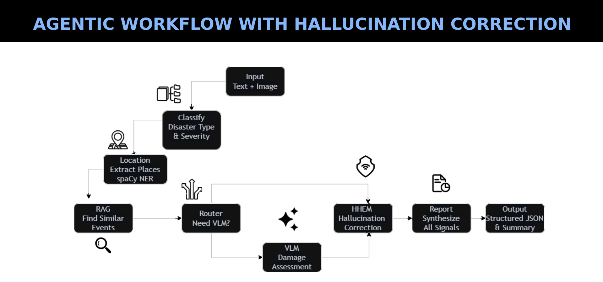

# DisasterPulse

Agentic RAG pipeline for real-time disaster event intelligence.  
Classifies events, extracts locations, retrieves historical context, 
and generates structured response reports — with optional visual damage 
assessment via LLaVA-class VLM.

**Live demo:** [https://disasterpulse-agenticrag-j83z0loky-syedfaisalabrars-projects.vercel.app/]

## Architecture




> 7-node LangGraph agentic pipeline with hallucination guard. Flow: text/image input → classifier → location extractor → RAG retriever → router decision → optional VLM analysis → **HHEM hallucination guard** → report synthesis

## Pipeline

Seven LangGraph nodes process each event end-to-end:

1. **Classifier** — llama-3.1-8b via Groq classifies disaster type and severity
2. **Location extractor** — spaCy NER identifies affected regions  
3. **RAG retriever** — ChromaDB semantic search pulls top-5 similar historical events
4. **Router** — decides whether image analysis is warranted
5. **VLM captioner** — Groq vision model assesses structural damage from uploaded images
6. **HHEM Guard** ← **NEW** — Vectara HHEM-2.1-Open detects hallucinations in generated summaries and auto-corrects if needed (score < 0.5 threshold)
7. **Report generator** — llama-3.1-8b synthesizes all signals into actionable JSON report with HHEM metadata

## Datasets

- **GDELT GKG** — global news event stream with disaster theme tags
- **CrisisMMD v2.0** (QCRI) — 18,082 crisis tweets with humanitarian labels and damage assessments across 7 disaster events
Link : https://crisisnlp.qcri.org/crisismmd

## Evaluation

Evaluated on 200 held-out CrisisMMD test queries:

| Metric | Score |
|--------|-------|
| nDCG@5 | 0.945 |
| nDCG@10 | 0.921 |
| MRR | 1.0 |
| Classifier macro-F1 (keyword baseline) | 0.692 |

Retrieval evaluation uses CrisisMMD damage severity labels as graded 
relevance (severe=3, mild=2, little/none=1). Classifier evaluation 
uses a keyword-matching baseline for reproducibility.

## Stack

Backend: FastAPI · LangGraph · ChromaDB · spaCy · Groq API · **Vectara HHEM-2.1-Open** (hallucination detection)  
Frontend: Next.js  
Embeddings: all-MiniLM-L6-v2  
LLM: llama-3.1-8b-instant (Groq)  
VLM: llama-4-scout vision (Groq)  
ML Framework: transformers (for HHEM model)

## Hallucination Guard (HHEM)

DisasterPulse now includes **Vectara HHEM-2.1-Open**, a state-of-the-art hallucination detector:

- **Detects hallucinations** in generated event summaries by comparing against RAG context
- **Scores consistency** on 0–1 scale; default threshold is 0.5
- **Auto-corrects** flagged summaries via Groq LLM (re-grounds all claims to RAG evidence)
- **Frontend integration**: "Vectara HHEM Guard" panel displays score, flags, and corrections in the UI
- **Optional deployment**: Falls back gracefully if `transformers` is not installed

**Configuration:**
```python
# In app/agents.py
HHEM_THRESHOLD = 0.5  # Detection boundary: < 0.5 = hallucinated
```

**Metrics in API Response:**
```json
{
  "hhem": {
    "score": 0.82,
    "triggered": false,
    "correction": null
  }
}
```

## Quick start

### 1. Clone & Setup

\```bash
git clone https://github.com/SyedFaisaLAbrar/DisasterPulse-Agentic-RAG-Pipeline-for-Real-Time-Disaster-Event-Intelligence.git
cd DisasterPulse
\```

### 2. Backend Environment

\```bash
python -m venv venv

# On Windows:
venv\Scripts\activate

# On macOS/Linux:
source venv/bin/activate
\```

### 3. Install Dependencies

\```bash
pip install -r app/requirements.txt
python -m spacy download en_core_web_sm
\```

**Note:** HHEM hallucination detection is included but **optional**. If `transformers` or `torch` fail to install, the pipeline will skip hallucination detection and operate normally. For full HHEM support, ensure you have a GPU or sufficient disk space for model downloads.

### 4. Configure API Keys

Create `app/.env` file:

\```bash
GROQ_API_KEY=gsk_your_key_here
HF_TOKEN=hf_your_token_here
\```

Get keys:
- **Groq API:** https://console.groq.com
- **Hugging Face:** https://huggingface.co/settings/tokens

### 5. Load Data

\```bash
cd app
python data_loader.py  # Indexes CrisisMMD & GDELT into ChromaDB
\```

### 6. Start Backend

\```bash
uvicorn main:app --reload --port 8000
\```

Backend runs at: http://localhost:8000

### 7. Start Frontend (Optional)

In a new terminal:

\```bash
cd frontend
npm install
npm run dev
\```

Frontend runs at: http://localhost:3000

**Frontend Enhancements (HHEM Edition):**
- The `/analyze` page now displays the **Vectara HHEM Guard** panel in real-time
- Shows hallucination consistency score (0–100%)
- Displays auto-corrected summaries when inconsistencies are detected
- Falls back gracefully if HHEM model is unavailable on the backend

## Related work

Built with reference to QCRI's Humanitarian Pulse project and  
CrisisMMD dataset (Alam et al., 2018).
